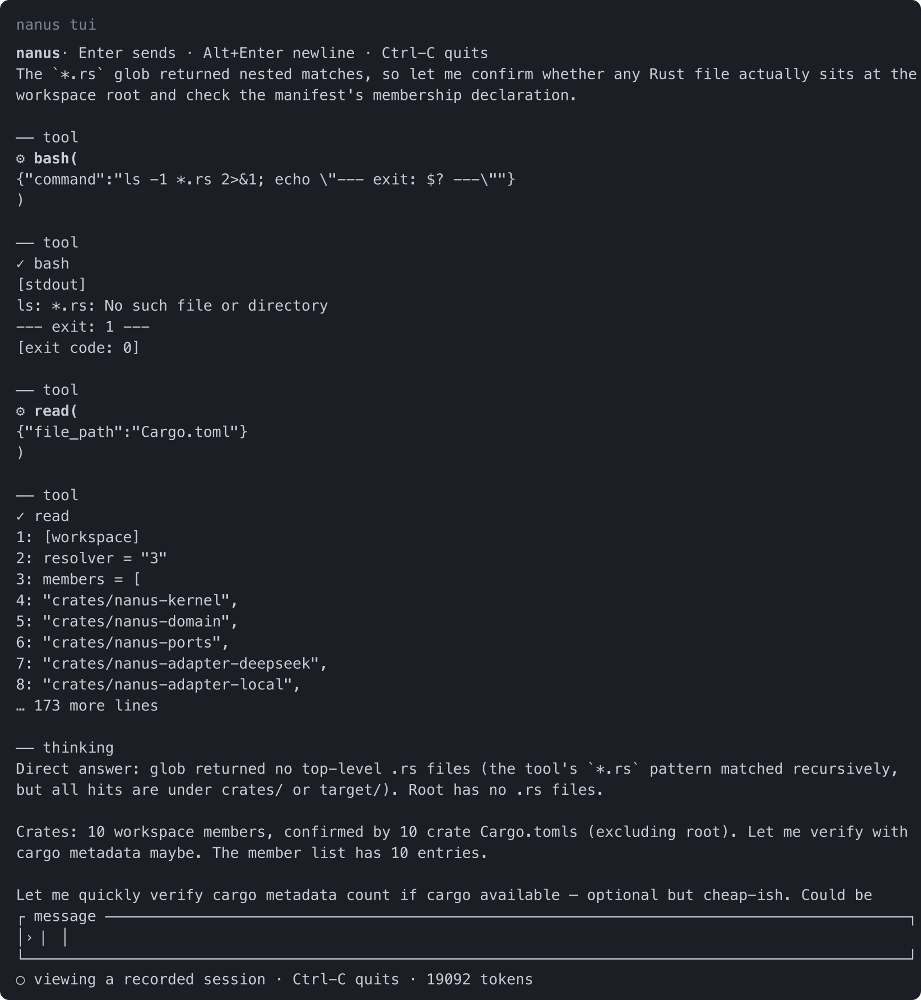

<div align="center">

# nanus

**A coding agent you can take apart.**

Eleven crates of safe Rust. A seven-tool toolset. Every part of it — the model adapter,
the tool registry, the session log, the permission policy, and the agent loop itself —
is a plugin you can remove, replace, or write yourself.

[](docs/testing.md)
[](docs/testing.md)
[](docs/design.md)
[](rust-toolchain.toml)
[](LICENSE)

</div>

---

```console
$ nanus run "Use the glob tool to list the top-level Rust files, then tell me how many crates are in this workspace."

## Answer

**There are 10 crates in this workspace.**

There are **none** at the top level. I ran `glob` with `*.rs`, and it returned matches
— but every one of them is nested under `crates/`. The root is a virtual manifest, so
it has no source files of its own.

### The 10 crates

`cargo metadata --no-deps` confirms 10 packages, matching the 10 `members` entries in
the root `Cargo.toml` — the counts agree three ways.
```

That transcript is real output, unedited. The interesting part is what came *before* the
answer: four steps, seven tool calls, and the model noticing on its own that `glob`'s
pattern wasn't anchored where it expected — a real bug in this repository that a test
suite had missed and a model found.

## The pitch

Most agent harnesses are a loop, a pile of tools, and a config file that grew until it
became an API. You can use them. You cannot easily *change* them, because the parts know
about each other and the seams are in the wrong places.

`nanus` starts from the opposite end. There is no privileged core to patch. There is a
context, and there are components that register into it. A component declares what it
needs. The runtime decides when it runs. When a component goes away, everything it touched
goes away with it.

That gives you three things that are hard to get any other way:

**Replace the model without touching the tools.** The adapter is a plugin behind an
`LlmPort`. Swapping DeepSeek for anything else is one provider, and the seven tools never
learn about it.

**Replace the tools without touching the model.** Each tool is a plugin behind a
`ToolExecutor`. Add one and its schema joins the prompt automatically. Remove one and it
stops existing, with no dead description left in every request.

**Unload a component and get your system back.** Every registration is recorded *with its
inverse*. Unloading a plugin reverts its effects in reverse order: services withdraw,
listeners unregister, consumers deactivate. No stale registrations, no restart to get
clean, no "did the reload work?" There is a test for it, and the test asserts on the trace
order.

That last property has a name in the literature — *temporal composability* — and it is
the reason this project exists rather than being another loop in a `main.rs`.

## Why it is called nanus

A chain of names, each one smaller than the last.

**[Cordis](https://github.com/cordiverse/cordis)** is the meta-framework underneath, from
the Latin *cor, cordis* — **heart**. The name is a declaration of intent: the framework is
meant to be the organ everything else depends on, not a component among them.

From *cor* comes **[Corvidae](https://en.wikipedia.org/wiki/Corvidae)** — the crows,
ravens, and jays. Among the most intelligent birds alive, and the only non-human animals
known to make hooks, use tools, and plan for a future they cannot see. If you are building
something that makes tools and uses them, you could do worse than a corvid for a mascot.

The smallest corvid in the world is the
**[dwarf jay](https://en.wikipedia.org/wiki/Dwarf_jay)**, *Cyanolyca nanus* — 20
centimetres, 40 grams, endemic to the pine-oak forests of southern Mexico. It is a jay, so
it is one of those tool-using, problem-solving birds. It is just very small.

**`nanus`** is the species epithet, and Latin for *dwarf*.

So: a small thing from a family of tool-users, named for the framework it was built on.
That is the whole idea. The smallest corvid that still uses tools.

> This is a tribute, not a claim — `nanus` is an independent project and borrows the
> framework's design, not its name's authority.

## Get started

Requires stable Rust (pinned in [`rust-toolchain.toml`](rust-toolchain.toml)) and
[`cargo-nextest`](https://nexte.st).

```sh
git clone https://github.com/antstanley/nanus.git
cd nanus
cargo build --release --workspace   # two binaries: the core, and the interface

export DEEPSEEK_API_KEY=...

# One shot: print the answer and exit.
./target/release/nanus run "Summarise this repository."

# See the reasoning and every tool call as it happens.
./target/release/nanus --verbose run "Find the TODO comments and group them by file."

# An agent that outlives the shell that started it.
./target/release/nanus service start
./target/release/nanus service status
./target/release/nanus service stop

# Come back to a conversation tomorrow, by name.
./target/release/nanus run --name nightly "summarise what changed today"
./target/release/nanus tui --resume nightly

# No key needed for either of these.
./target/release/nanus config      # the effective configuration
./target/release/nanus sessions    # transcripts of everything you have run
```

Three modes, one agent. `run` keeps it for a turn, `tui` for as long as the interface is
open, and `service` until you stop it — and the interface is always a client, over a
local socket, whether the agent beside it is one this shell started or one that has been
up since boot.

A conversation is a thing rather than an event. Name it, come back to it, or attach to it
while an agent is still in the middle of it — and watch from a second terminal, because
every client on a session sees the same turn.

**stdout carries the answer and nothing else.** Reasoning and tool activity go to stderr.
The exit code is part of the contract: `0` only for a completed turn, non-zero otherwise,
so a script can tell a finished run from a failed one without parsing output.

Those two need no key at all, which makes them the fastest way to see what the harness
thinks it is:

```console
$ nanus config
model: deepseek-flash
max tokens: 8192
reasoning effort: Medium
approval policy: Ask
sandbox mode: ReadOnly
max steps per turn: 32
workspace root: <the current directory>
service socket: /Users/you/.config/nanus/run/agent.sock
service log: /Users/you/.config/nanus/nanus-service.log
api key: not set

$ nanus sessions
01a09558-9f82-720e-960b-8a587e072667  25 events  /Volumes/.../nanus  Use the glob tool to list the top-level Rust files…
01a0954e-4241-76e3-9316-d6b3a88e823f   6 events  /Volumes/.../nanus  Say hi
```

### Or sit in front of it

Typing the program's name with a terminal starts the interface:

```sh
export DEEPSEEK_API_KEY=...
./target/release/nanus
```



*Real output, captured from the binary — not a mock-up. It is a **recorded** conversation,
which is the point: reading a transcript needs no API key.*

The core starts an agent for this shell, then runs the interface **as a separate
program** and serves it over a local socket. Two binaries, because the interface is the
part that grows and the core is the part that must not: `nanus` does not link `nanus-tui`
at all, so a change to the rendering cannot change what a script runs. Piped or
redirected, a bare `nanus` prints its usage rather than trying to draw on something that
is not a terminal.

The same interface reaches an agent that was started somewhere else:

```sh
nanus service start     # an agent that outlives the shell
nanus tui --connect     # sit in front of it
```

Every run persists its session, so the interface doubles as a browser for what you have
already done:

```sh
nanus sessions                    # list what is available
nanus tui --session               # read the most recent one
nanus tui --session <id>          # read a particular one
nanus tui --session --scroll 50   # open fifty rows back, where the tool calls are
```

Keys, rendering choices, and why the interface is testable at all:
[**docs/tui.md**](docs/tui.md).

### Is it any good?

```console
$ cargo fmt --all --check
clean

$ cargo clippy --workspace --all-targets --all-features
0 warnings, 0 errors

$ cargo nextest run --workspace --all-features
Summary [2.8s] 643 tests run: 643 passed, 0 skipped

$ cargo test --workspace --doc
10 doctests passed
```

`unsafe` appears nowhere — every crate forbids it *and* the workspace denies it, because
the manifest lint alone does not cover doctests. For what that buys you, why the toolset is
exactly seven tools, how the crates fit together, and the two bugs verification caught that
reasoning did not, see [**the documentation**](docs/).

## Acknowledgements

**[Cordis](https://github.com/cordiverse/cordis)** is the meta-framework this implements —
a work of real originality, and the reason this project has an architecture rather than
just a loop.

**_A Programming Paradigm for Spatiotemporal Composability_**
([arXiv:2608.25512](https://arxiv.org/abs/2608.25512)) by Shi, Zhang, and Cui (Peking
University; DeepSeek-AI) is the calculus behind the kernel's effect and coeffect
mechanisms. Its 92 pages are the best explanation available of why unloading a plugin
should give your system back.

**[DeepSeek Harness](https://github.com/deepseek-ai/deepseek-harness)**, also from
DeepSeek-AI, is the reference agent harness. Much of `nanus` is an argument with it — where
it differs, [`docs/design.md`](docs/design.md) says so and why.

**[Tiger Style](https://github.com/tigerbeetle/tigerbeetle/blob/main/docs/TIGER_STYLE.md)**
(TigerBeetle) is the coding standard, and its insistence on assertions-as-invariants is
most of why the kernel is trustworthy.

**[ratatui](https://ratatui.rs)** draws the terminal interface, and its `TestBackend` is
most of why that interface is testable at all.

The **[DeepSeek API documentation](https://api-docs.deepseek.com/)** is the wire contract
`nanus-adapter-deepseek` implements, down to the details that are easy to get wrong — that
an empty assistant turn must send `content: ""` rather than `null`, and that earlier
turns' `reasoning_content` has to be replayed whenever a request carries tools.

And the **[dwarf jay](https://en.wikipedia.org/wiki/Dwarf_jay)**, which is just very good
and has nothing to do with software.

## License

MIT. See [SAFETY.md](SAFETY.md) before running it on a machine you care about — it explains
what the agent can do, what the defaults do and do not protect you from, and why prompt
injection is a real concern for anything that reads files.
